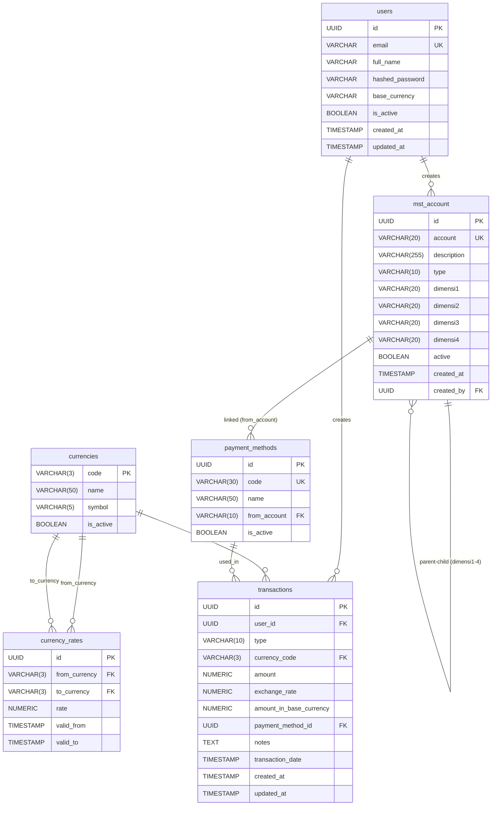

# Database Schema - Fin_Track

Dokumen ini berisi struktur tabel dan relasi yang digunakan pada database PostgreSQL proyek **Fin_Track**. Dokumen ini **wajib diperbarui** setiap kali ada penambahan atau perubahan skema (migrasi).

## Entity Relationship Diagram (ERD)

---

## Tabel Detail

### 1. `users`
Menyimpan data pengguna yang terdaftar di aplikasi.
| Column | Type | Constraints | Description |
| :--- | :--- | :--- | :--- |
| `id` | UUID | Primary Key | Identifier unik pengguna |
| `email` | VARCHAR | Unique, Not Null | Email untuk login |
| `full_name` | VARCHAR | Not Null | Nama lengkap |
| `hashed_password` | VARCHAR | Not Null | Password terenkripsi (Argon2) |
| `base_currency` | VARCHAR | Not Null, Default: IDR | Mata uang utama pengguna |
| `is_active` | BOOLEAN | Default: True | Status akun |
| `is_superuser` | BOOLEAN | Default: False | Akses superadmin |
| `created_at` | TIMESTAMP | Default: now() | Waktu pembuatan akun |
| `updated_at` | TIMESTAMP | Default: now() | Waktu pembaruan akun |

### 2. `mst_account` (Master General Ledger)
Menyimpan bagan akun (Chart of Accounts) standar akuntansi.
| Column | Type | Constraints | Description |
| :--- | :--- | :--- | :--- |
| `account` | VARCHAR(10) | Primary Key | Kode akun GL |
| `description` | VARCHAR(255)| Not Null | Nama / deskripsi akun |
| `type` | VARCHAR(10) | Not Null | Enum: `Debit` / `Credit` |
| `dimensi1` | VARCHAR(10) | FK -> `mst_account.account` | Dimensi hierarki tingkat 1 |
| `dimensi2` | VARCHAR(10) | FK -> `mst_account.account` | Dimensi hierarki tingkat 2 |
| `dimensi3` | VARCHAR(10) | FK -> `mst_account.account` | Dimensi hierarki tingkat 3 |
| `dimensi4` | VARCHAR(10) | FK -> `mst_account.account` | Dimensi hierarki tingkat 4 |
| `active` | BOOLEAN | Default: True | Status aktif akun |
| `created_at` | TIMESTAMP | Default: now() | Waktu rekam |
| `created_by` | UUID | FK -> `users.id` | User pembuat akun (opsional) |

### 3. `currencies`
Menyimpan daftar mata uang yang didukung aplikasi.
| Column | Type | Constraints | Description |
| :--- | :--- | :--- | :--- |
| `code` | VARCHAR(3) | Primary Key | Kode ISO mata uang (IDR, USD) |
| `name` | VARCHAR(50) | Not Null | Nama mata uang |
| `symbol` | VARCHAR(5) | Not Null | Simbol mata uang (Rp, $) |
| `is_active` | BOOLEAN | Default: True | Status mata uang aktif/tidak |
| `created_at` | TIMESTAMP | Default: now() | Waktu rekam |

### 4. `currency_rates`
Menyimpan historis nilai tukar / kurs antar mata uang.
| Column | Type | Constraints | Description |
| :--- | :--- | :--- | :--- |
| `id` | UUID | Primary Key | Identifier unik kurs |
| `from_currency` | VARCHAR(3) | FK -> `currencies.code` | Mata uang asal |
| `to_currency` | VARCHAR(3) | FK -> `currencies.code` | Mata uang tujuan |
| `rate` | NUMERIC(18,6)| Not Null | Nilai tukar |
| `valid_from` | TIMESTAMP | Default: now() | Kapan kurs mulai berlaku |
| `valid_to` | TIMESTAMP | Nullable | Akhir masa berlaku kurs |

### 5. `payment_methods`
Menyimpan metode pembayaran yang terikat langsung ke akun General Ledger.
| Column | Type | Constraints | Description |
| :--- | :--- | :--- | :--- |
| `id` | UUID | Primary Key | Identifier unik metode |
| `user_id` | UUID | FK -> `users.id`, Nullable | Pemilik metode (jika null = template) |
| `code` | VARCHAR(30) | Not Null | Kode metode pembayaran |
| `name` | VARCHAR(100) | Not Null | Nama / label metode |
| `from_account` | VARCHAR(20) | Nullable | GL Account referensi |
| `is_active` | BOOLEAN | Default: True | Status aktif (untuk soft-delete) |
| `is_template` | BOOLEAN | Default: False | Apakah data ini template? |
| `is_public` | BOOLEAN | Default: False | Apakah template ini publik? |
| `created_at` | TIMESTAMP | Default: now() | Waktu pembuatan |
| `updated_at` | TIMESTAMP | Default: now() | Waktu modifikasi terakhir |

**Catatan**: Terdapat *composite unique constraint* pada `(user_id, code, is_template)`.

### 6. `transactions`
Menyimpan data transaksi pemasukan maupun pengeluaran.
| Column | Type | Constraints | Description |
| :--- | :--- | :--- | :--- |
| `id` | UUID | Primary Key | Identifier unik transaksi |
| `user_id` | UUID | FK -> `users.id` | Pemilik transaksi |
| `type` | VARCHAR(10) | Not Null | Enum: `EXPENSE` / `INCOME` |
| `currency_code`| VARCHAR(3) | FK -> `currencies.code` | Mata uang saat transaksi |
| `amount` | NUMERIC(15,2)| Not Null | Nominal sesuai `currency_code` |
| `exchange_rate`| NUMERIC(18,6)| Not Null | Kurs pada saat transaksi |
| `amount_in_base_currency` | NUMERIC(15,2)| Not Null | Nominal dikali kurs (*Base*) |
| `payment_method_id`| UUID | FK -> `payment_methods.id`| Metode bayar yang dipakai |
| `notes` | TEXT | Nullable | Catatan/keterangan transaksi |
| `transaction_date`| TIMESTAMP | Default: now() | Waktu aktual transaksi |
| `created_at` | TIMESTAMP | Default: now() | Waktu pencatatan di DB |
| `updated_at` | TIMESTAMP | Default: now() | Waktu pembaruan di DB |
